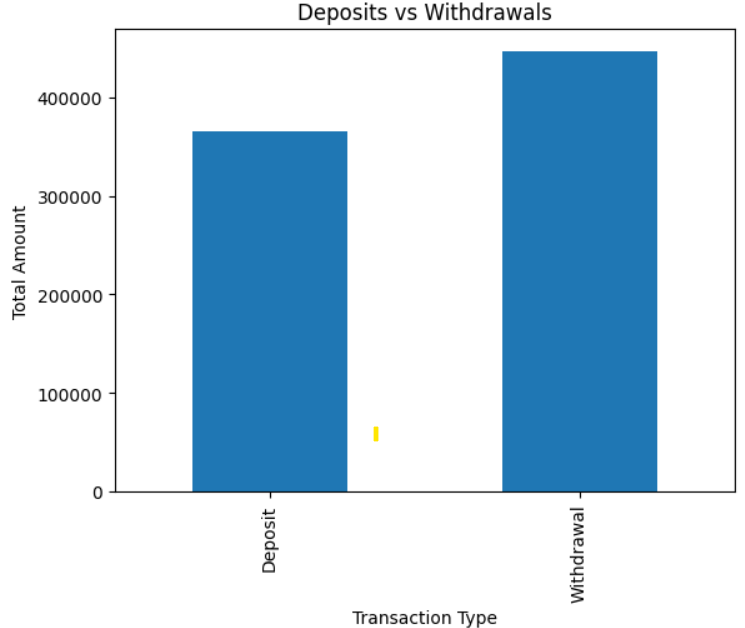
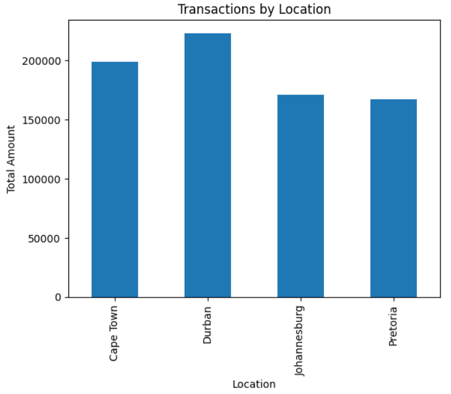

# Banking Transaction Data Analytics

## Overview
This project analyzes banking transaction data to identify data quality issues, detect suspicious transactions, and generate business insights.

## Dataset
The dataset was synthetically generated and enhanced with real-world data issues such as:
- Missing values
- Duplicate records
- Suspicious transactions
- Invalid data

## Features
- Data quality analysis (missing values, duplicates, invalid data)
- Fraud detection (large and unusual transactions)
- Business insights (customer activity, transaction trends)
- Data visualizations using Matplotlib
- Exportable reports

## Tools & Technologies
- Python
- Pandas
- Matplotlib
- Jupyter Notebook

## Key Insights
- Identified high-value transactions that may indicate fraud
- Detected inconsistencies in financial data
- Analyzed customer and regional transaction patterns

## Outputs
- Data Quality Report (CSV)
- Business Insights Report (CSV)
- Visualizations (PNG)

## How to Run
1. Open the Jupyter Notebook
2. Run all cells
3. View outputs and generated reports

## Sample Visualizations

### Deposits vs Withdrawals

### Transactions by Location

